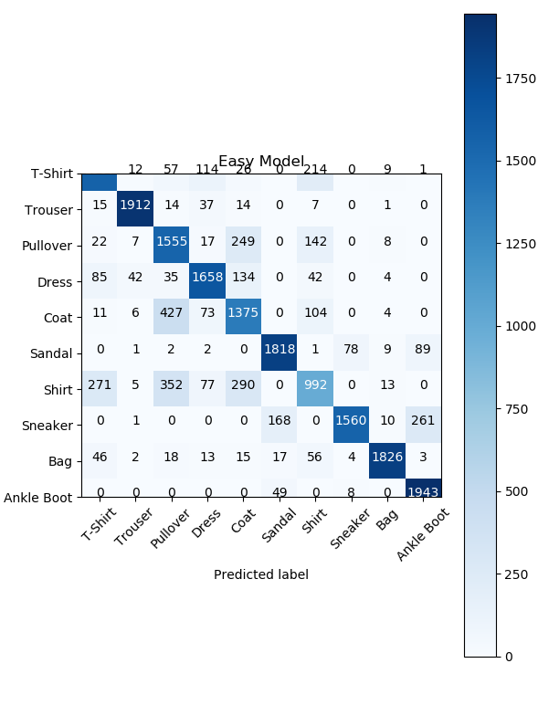
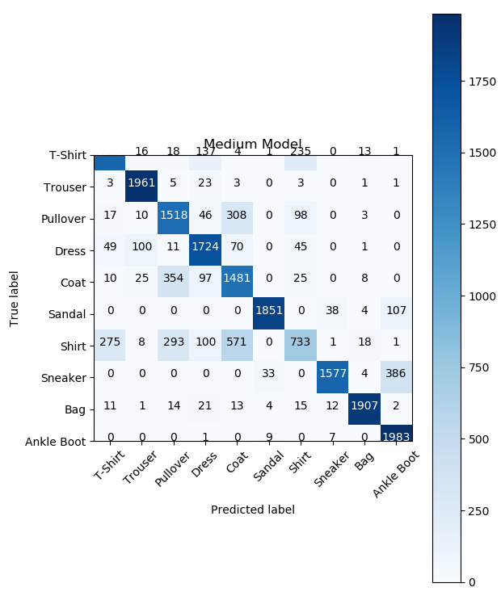
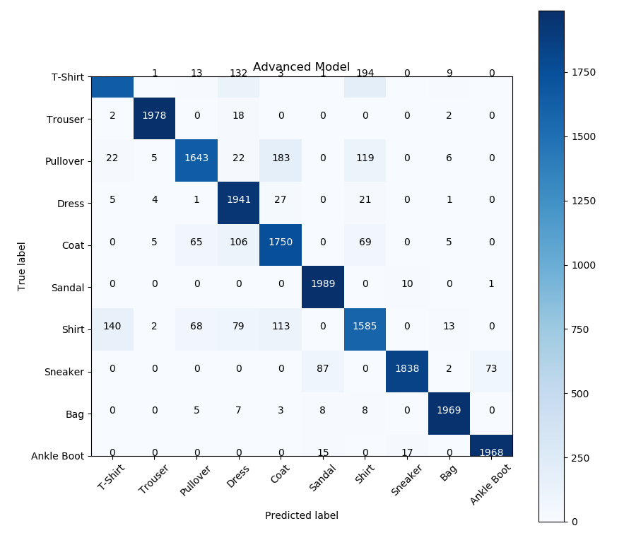

# Fashion MNIST

This repository was an exercice to use [Pytorch](https://pytorch.org/) to create 3 Neural Network models and train/test them on the [Fashion MNIST](https://github.com/zalandoresearch/fashion-mnist) dataset.

3 NN models were made:

- An easy model with a single linear layer
- A medium model with Fully-Connected Network with 2 hidden layers.
- An advanced model with a multitude of different layers to try and get the best results.

Please take in account that this code was written in a few days without any professional review/standard as an exercice.

## Getting Started

All 3 NN models are located in ["models.py"](models.py). Look there if you want more information on the architecture of each model.

The file ["fashion_mnist.py"](fashion_mnist.py) contains all the code to load the data set, run the models and visualize the results with a confusion matrix.

### Prerequisites

- [pytorch](https://pytorch.org/)
- [matplotlib](https://matplotlib.org/)
- [sklearn](https://scikit-learn.org/stable/)
- [Numpy](https://numpy.org/)

## Running the models

You can run all the models with the following command:

```[python]
python3 fashion_mnist.py
```

## Results

We run each model with for 2 epochs, a batch size of 100 and a learning rate of 0.001. The following are the accuracy results and confusion matrix for each model.

### Easy model

~80 percent accuracy



### Medium model

~83 percent accuracy



### Advanced model

~91 percent accuracy



## Authors

- **Raphael Van Hoffelen** - [github](https://github.com/dskart) - [website](https://www.raphaelvanhoffelen.com/)

## License

This project is licensed under the MIT License - see the [LICENSE.md](LICENSE.md) file for details
